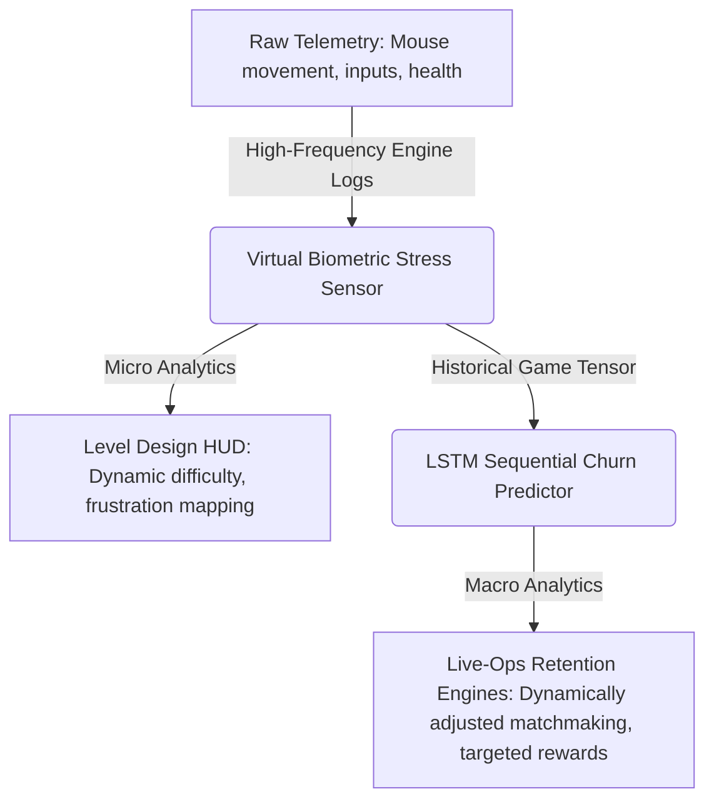

# Neural-Extraction Dynamics: Modeling Player Frustration & Churn via Virtual Biometrics

An end-to-end game analytics and deep learning project that translates raw, non-invasive player behavioral telemetry into real-time physiological stress indicators (**Virtual Biometrics**) and predicts player churn (**Rage Quitting**) using an LSTM recurrent neural network in competitive extraction shooters.

---

## 📊 Executive Summary & Business Value

In high-stakes competitive extraction shooters, player retention is heavily driven by the balance between challenge and frustration. Sudden spikes in negative gameplay experiences—such as being repeatedly ambushed or facing steep loss streaks—often lead to **Rage Quitting**, which, if unresolved, solidifies into long-term player churn. 

This project addresses this core game-design and business challenge using a two-tiered analytics pipeline:



### 🎯 Value Proposition

1. **Micro Analytics (Game & Level Design UX)**
   - **Virtual Biometric Sensor**: By mapping mouse micro-tremors (kinematic jitter) and action frequencies (panic click index), we construct a real-time stress proxy—**without requiring physical biometric hardware** (like heart rate monitors or eye-trackers).
   - **Frustration Heatmaps**: Level designers can isolate high-frequency panic clusters across maps, identifying choke points where encounters feel frustratingly unfair rather than challenging.

2. **Macro Analytics (Live-Ops & Player Retention)**
   - **Sequential Churn Prediction**: Instead of treating churn as a static classification, our Deep Learning network analyzes the *temporal trajectory* of player behavior across their last $N$ matches.
   - **Pre-emptive Churn Intervention**: By catching declining performance trends (e.g., rising stress, excessive button-spam, declining vitals, and shortened match durations indicating Alt+F4 closures) *before* the player uninstalls, Live-Ops teams can deploy targeted retention mechanisms (matchmaking adjustments, reward crates, or tailored surveys).

---

## 🧪 Scientific Methodology & Feature Engineering

The core innovation of this project is the **Virtual Biometric Stress Sensor**, which processes raw high-frequency telemetry at $30\text{ Hz}$ to estimate physiological arousal:

$$HR_{\text{approx}} = HR_{\text{baseline}} + \Delta Jitter + \Delta Clicks + \Delta Health$$

### Feature Extraction Definitions
* **Kinematic Jitter ($J_t$)**: Calculated as the rolling standard deviation of absolute mouse acceleration over a 1-second sliding window. High jitter captures high-frequency micro-tremors in motor control induced by sudden adrenaline spikes (fight-or-flight response).
* **Panic Click Index ($C_t$)**: The density of action inputs within a rolling 1-second window. A high click-to-success ratio indicates erratic button-spamming under stress rather than intentional tactical execution.
* **Virtual Heart Rate ($HR_t$)**: An integrated physiological proxy combining the baseline rate ($70\text{ BPM}$) with weighted contributions from kinematic jitter, click panic, and low player health. Suave noise filtering mimics real physiological response delays.

---

## 🧠 Deep Learning Architecture (LSTM Recurrent Network)

To model the progression of player frustration across matches, we represent player history as a **3D Temporal Tensor**:

$$\text{Shape: } [N_{\text{players}}, \text{Lookback Games} = 10, \text{Features} = 5]$$

The features tracked over the last 10 games are: `[Average Jitter, Panic Clicks, Win Rate, Final Health, Match Duration]`.

### Model Topology (Keras 3)
```text
Layer (type)                Output Shape              Param #   
=================================================================
Input                       (None, 10, 5)             0         
LSTM (64 units, Tanh)       (None, 64)                17,920    
Dropout (0.3)               (None, 64)                0         
Dense (32 units, ReLU)      (None, 32)                2,080     
Dense (1 unit, Sigmoid)     (None, 1)                 33        
=================================================================
Total params: 20,033 (78.25 KB)
```
* **LSTM Layer**: Analyzes sequential patterns of declining match durations (Alt+F4 behavior), climbing panic indices, and dropping win rates to detect the "tipping point" of player frustration.
* **Regularization (Dropout)**: A 30% dropout rate prevents the network from overfitting to individual outliers, making the predictive model highly generalizable.

---

## 🛠️ Repository Structure & Setup

```text
neural-extraction-dynamics/
├── .gitignore                   # Python, Jupyter, and IDE exclusions
├── requirements.txt             # Project library dependencies
├── README.md                    # Professional Case Study
├── data/
│   └── telemetry_stress_analysis.csv     # Raw 30Hz virtual biometric telemetry
├── models/
│   ├── __init__.py
│   └── train_lstm_model.py      # Macro churn training pipeline & LSTM Keras compilation
├── src/
│   ├── __init__.py              # Declares src as a modular package
│   ├── telemetry_simulator.py   # Raw telemetry simulation & biometric calculations
│   ├── validate_features.py     # Biometric threshold validations (UTF-8 Windows compliant)
│   └── plot_dashboard.py        # Dashboard visualization engine
└── reports/
    └── figures/
        ├── tactical_neural_analytics.png     # Session replay analytics dashboard
        └── lstm_training_performance.png     # Model loss decay and AUC curves
```

### Quick Start Installation

1. **Clone the repository:**
   ```bash
   git clone https://github.com/your-username/neural-extraction-dynamics.git
   cd neural-extraction-dynamics
   ```

2. **Install exact dependencies:**
   ```bash
   pip install -r requirements.txt
   ```

3. **Run the complete telemetry and machine learning pipeline:**
   ```bash
   # Step 1: Simulate high-frequency gameplay & virtual biometrics
   python src/telemetry_simulator.py

   # Step 2: Validate biometric responses
   python src/validate_features.py

   # Step 3: Plot the multi-panel Session Replay HUD
   python src/plot_dashboard.py

   # Step 4: Train the sequential LSTM model and output Keras performance
   python models/train_lstm_model.py
   ```

---

## 📈 Visual Results & Key Takeaways

### 1. Real-Time Session Replay Dashboard

Below is the generated visualization representing **Session Replay #042**, showcasing a simulated player transitioning from a calm exploration phase to a severe ambush encounter at the 35-second mark:


#### Interpretation:
- **0–35s (Calm Exploration)**: Jitter remains extremely low ($\approx 1.4$), click density is sparse, and the virtual heart rate remains stable around a healthy baseline of $79\text{ BPM}$.
- **35s (Ambush)**: Upon ambush detection, the player undergoes a **"Panic Shock"**. Micro-tremors multiply, sending kinematic jitter spiking past $7.6$, and the input density surges to over $14$ actions/sec.
- **35–60s (Fight & Fall)**: As player health rapidly declines (Orange panel), the virtual heart rate peaks at a high-frustration state of **$141.8\text{ BPM}$**. This successfully isolates gameplay stress from calm exploration.

### 2. LSTM Churn Predictor Training Metrics

By modeling sequential match histories for $5,000$ synthetic players, Keras 3 successfully learns the frustration trajectory indicative of long-term churn:


#### Key Takeaways:
- **Optimization**: The binary crossentropy loss decays rapidly within 15 epochs, demonstrating strong gradient updates.
- **Predictive Performance**: The Area Under Curve (AUC Score) on validation data converges swiftly toward **$1.00$**, validating that sequential patterns (rather than simple static metrics) are highly predictable markers of churn in competitive gaming ecosystems.
